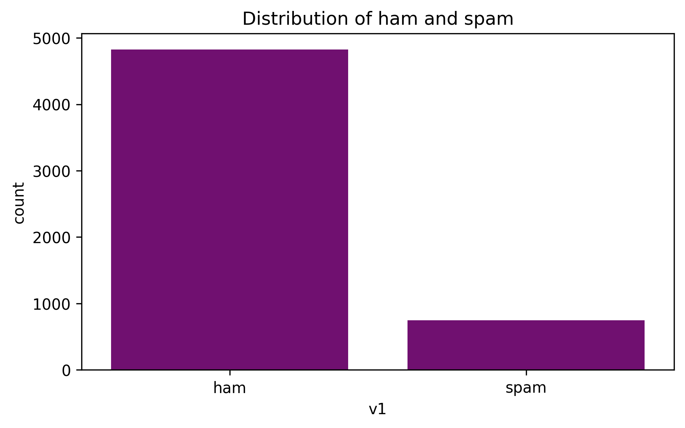
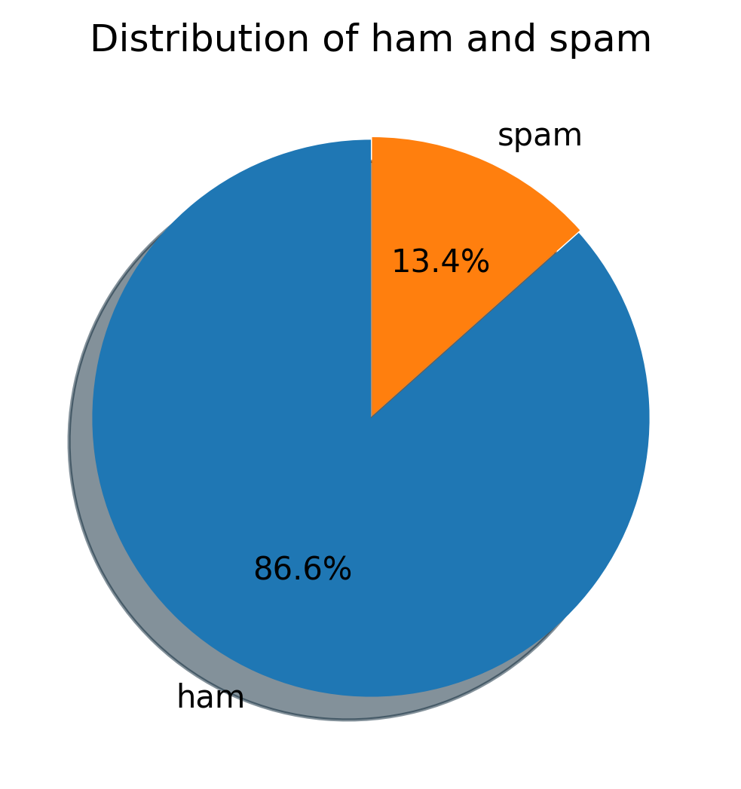
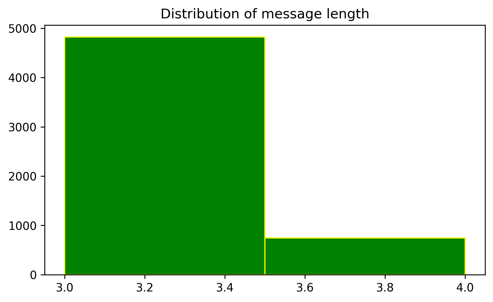
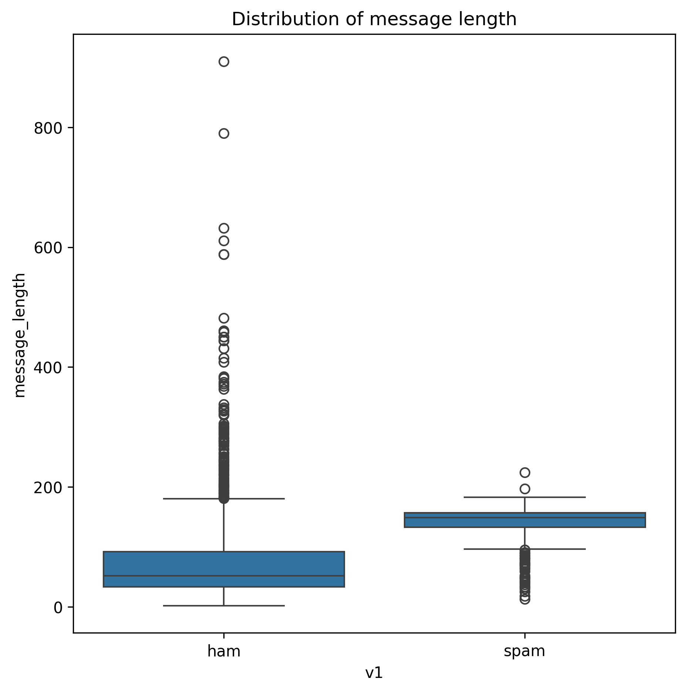
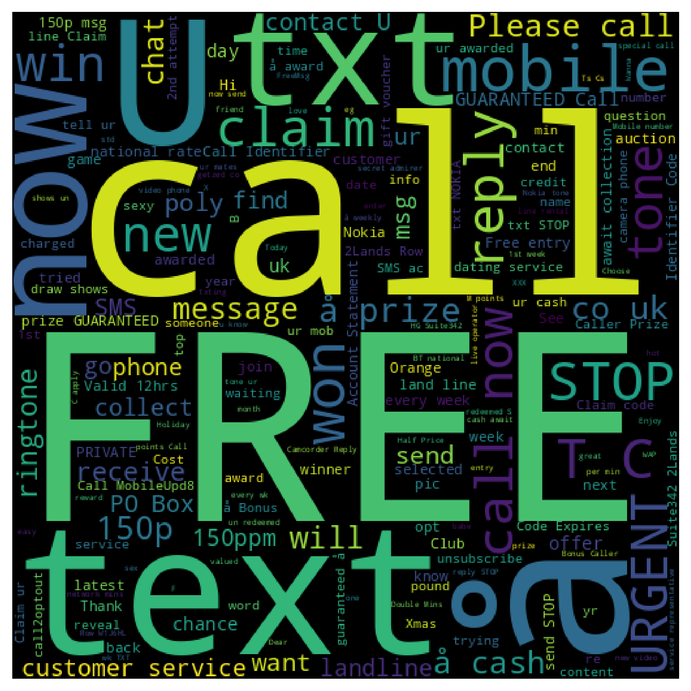
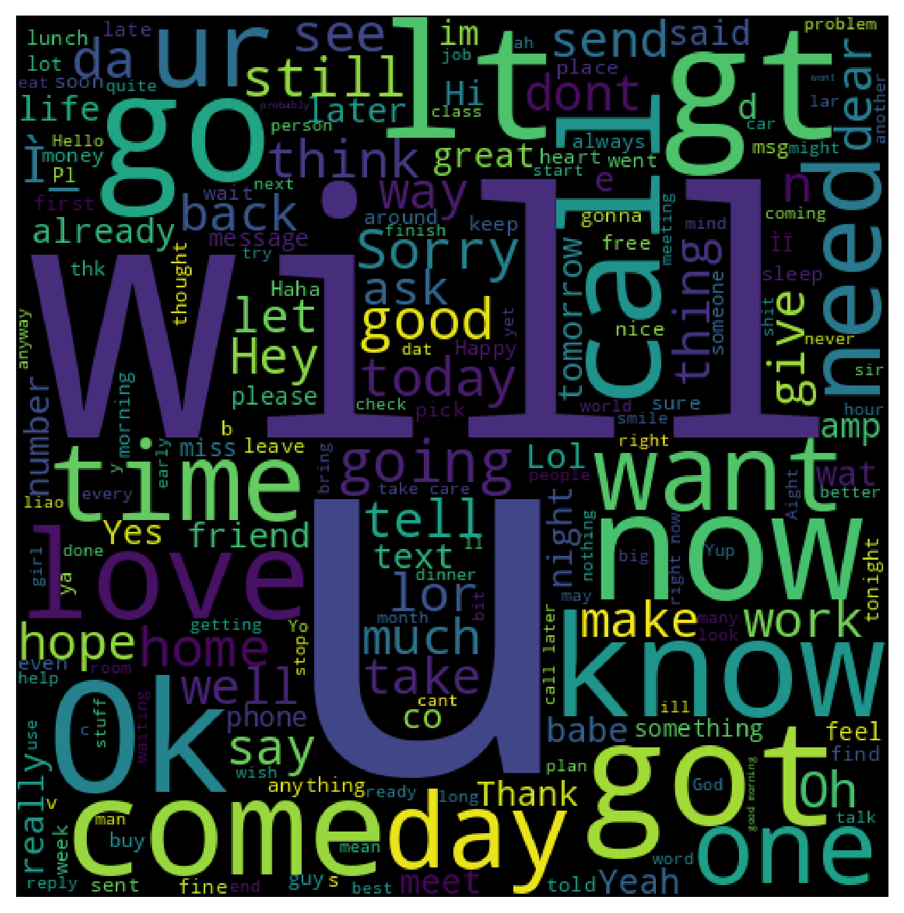
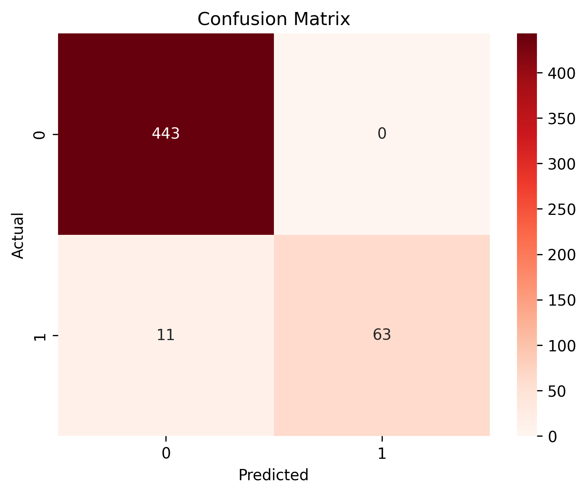
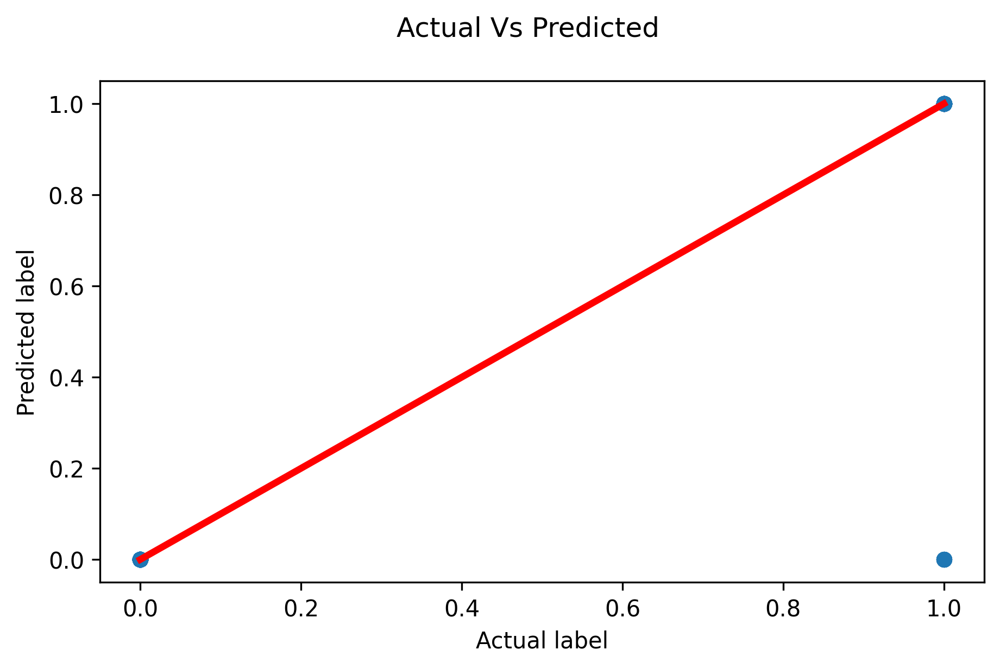

# **📩 SMS Spam Classifier**

> Detect Spam 🚫 and Ham ✅ messages using Natural Language Processing (NLP) and Machine Learning.

🏆 **Model Accuracy:** **97.87%** ✅
---
## ✨ Repository Highlights

✔ NLP-Based SMS Spam Detection

✔ Text Preprocessing Pipeline

✔ TF-IDF Feature Extraction

✔ Machine Learning Model Training

✔ Model Evaluation Metrics

✔ Confusion Matrix

✔ Data Visualizations

✔ Saved ML Model (.pkl)

✔ Saved TF-IDF Vectorizer

✔ Clean & Beginner-Friendly Notebook
---

# **🌟 Project Overview**

This project builds a Machine Learning model capable of automatically classifying SMS messages as **Spam** or **Ham**.

The project applies **Natural Language Processing (NLP)** techniques such as text cleaning, stemming, stopword removal and TF-IDF Vectorization before training a Machine Learning classifier.

---

# 🚀 Features

✅ Spam Detection

✅ Ham Detection

✅ Text Preprocessing

✅ Tokenization

✅ Stopword Removal

✅ Stemming

✅ TF-IDF Feature Extraction

✅ Machine Learning Classification

✅ Model Serialization (.pkl)

✅ Data Visualization

---

# 🛠 Tech Stack

- 🐍 Python
- 🐼 Pandas
- 🔢 NumPy
- 🤖 Scikit-Learn
- 📚 NLTK
- ☁️ WordCloud
- 📈 Matplotlib
- 🎨 Seaborn

---

# 📂 Project Structure

```text
SMS-SPAM-CLASSIFIER
│
├── Graphs
│   ├── Countplot.png
│   ├── Distribution of message length.png
│   ├── Histogram.png
│   ├── Wordcloud.png
│   ├── Wordcloud of ham.png
│   ├── Confusion Matrix.png
│   └── Actual Vs Predicted.png
│  
├── SMS_SPAM_COLLECTION.ipynb
├── spam_model.pkl
├── tfidf.pkl
├── README.md
└── requirements.txt
```

---

# 📂 Dataset

This project uses the **SMS Spam Collection Dataset** from Kaggle.

🔗 **Dataset Link:**

https://www.kaggle.com/datasets/uciml/sms-spam-collection-dataset

### Dataset Details

- 📄 Total Messages: **5,572**
- ✅ Ham Messages: **4,825**
- 🚫 Spam Messages: **747**
- 📝 Features:
  - **v1** → Message Label (Ham / Spam)
  - **v2** → SMS Message Text

---

# ⚙️ Machine Learning Workflow

📩 SMS Dataset

⬇️

🧹 Data Cleaning

⬇️

🔤 Tokenization

⬇️

🚫 Stopword Removal

⬇️

✂️ Stemming

⬇️

🔢 TF-IDF Vectorization

⬇️

🤖 Model Training

⬇️

📈 Prediction

---

# 📈 Model Performance

| Metric | Score |
|---------|-------:|
| 🎯 Training Accuracy | **97.94%** |
| ✅ Testing Accuracy | **97.87%** |

### Evaluation Metrics

✔ Accuracy Score

✔ Precision Score

✔ Recall Score

✔ F1 Score

✔ Classification Report

✔ Confusion Matrix

> **Training Accuracy:** 0.97936  
> **Testing Accuracy:** 0.9787234

The close training and testing accuracies indicate that the model generalizes well to unseen SMS messages with minimal overfitting.
---

# 📈 Visualizations

✔️ 📊 Count Plot

✔️ 🥧 Pie Chart

✔️ 📉 Histogram

✔️ 📦 Box Plot

✔️ 🔥 Correlation Heatmap

✔️ ☁️ Spam WordCloud

✔️ ☁️ Ham WordCloud

✔️ 📊 Confusion Matrix

✔️ 📈 Actual vs Predicted


---

# 📸 Results

## 📊 Count Plot



---

## 🥧 Pie Chart



---

## 📉 Histogram



---

## 📦 Box Plot



---

## ☁️ Spam WordCloud



---

## ☁️ Ham WordCloud



---

## 📊 Confusion Matrix



---

## 📈 Actual vs Predicted



---

# 📈 Model Evaluation

✔ Accuracy Score

✔ Precision Score

✔ Recall Score

✔ F1 Score

✔ Classification Report

✔ Confusion Matrix

---

# ▶️ Installation

```bash
git clone <repository-link>

cd SMS-SPAM-CLASSIFIER

pip install -r requirements.txt
```

---

# 💻 Run

Open the notebook and execute all cells.

```
SMS_SPAM_COLLECTION.ipynb
```

---

# 🚀 Future Improvements

✨ Streamlit Web App

✨ Deep Learning (LSTM)

✨ BERT Spam Detection

✨ Multi-language Spam Detection

✨ Cloud Deployment

---

# ❤️ Author

**Himangi Gupta**

---

##  **If you like this project, don't forget to Star ⭐ the repository.**